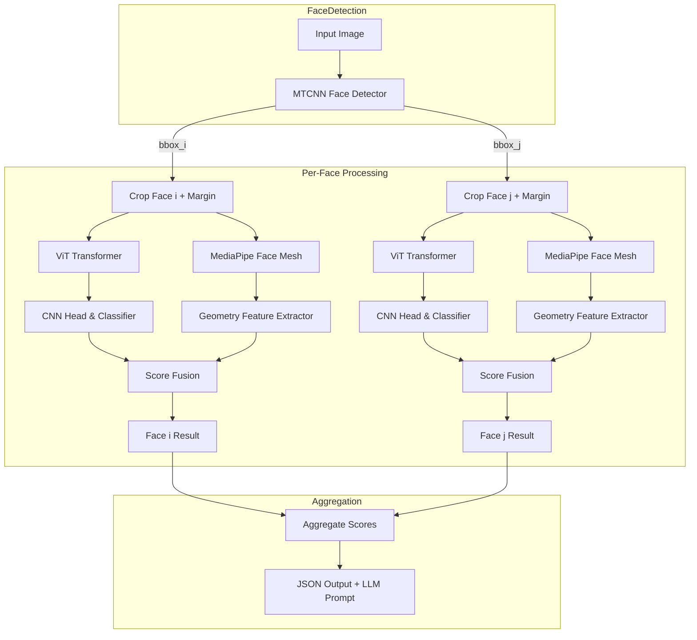

# Deepfake Detection Pipeline Implementation Plan

## Executive Summary  
This document outlines a **comprehensive implementation plan** for a multi-face, LLM-ready deepfake detection pipeline. We will integrate:  
- **MTCNN (facenet-pytorch)** for face detection (supporting multiple faces)【32†L332-L339】【38†L231-L238】  
- **Hybrid ViT→CNN classifier** (existing model) for texture-based deepfake confidence  
- **MediaPipe Face Mesh** for 3D facial landmarks (468 points)【5†L281-L289】  
- **Geometry-based feature extraction** (eye asymmetry, mouth openness, etc.) from landmarks  
- **Score fusion and aggregation** to combine texture and geometry signals  
- **Structured JSON output** for each face and overall decision (LLM-friendly)  

The goal is a **handoff-ready** Markdown spec for Antigravity engineers to implement on a Linux/GPU environment. We assume the existing model provides a function like `predict_model(face_image: PIL.Image) -> (label: str, confidence: float)` (label ∈ {“Real”, “Deepfake”}). We will **not modify the core model**, only wrap it in the pipeline. The pipeline will limit to **max 5 faces per image**, with configurable parameters (e.g. face-crop margin default 0.2, fusion weights default CNN:0.85, geom:0.15). 

Key improvements: robust handling of *multi-face images*, reduced background noise, geometry-based sanity checks, and fully explainable outputs for a downstream LLM. 

## Goals  
- **Multi-face support:** Detect and process up to 5 faces per image.  
- **Background robustness:** Crop faces with margin to exclude clutter.  
- **Hybrid inference:** Use existing ViT→CNN model’s final confidence as primary deepfake score.  
- **Geometry validation:** Compute simple facial geometry features (eye/lip symmetry) from landmarks【5†L281-L289】.  
- **Score fusion:** Combine CNN confidence with geometry anomaly score (configurable weights).  
- **Aggregation:** Merge multiple-face scores into an overall image verdict (averaging top-K face scores).  
- **Explainability:** Output per-face details (scores, boxes, features) in JSON, enabling an LLM to reason and explain.  
- **Reliability:** Handle edge cases gracefully (no faces, failed landmark detection, small/occluded faces).  
- **Performance:** Use PyTorch best practices (`model.eval()`, `torch.no_grad()`)【36†L453-L458】【37†L375-L382】 and reuse static resources.  
- **Deliverables:** Markdown spec (this document), with mermaid diagrams, code snippets, test plan, and a prioritized task list (JIRA-style). Also instructions for PDF export.  

---

## Architecture Diagram  



- **B**: MTCNN outputs bounding boxes for all faces (using `keep_all=True`【38†L231-L238】).  
- **C1/C2**: Crop faces with a margin (e.g. 20% around detected box) to include context but reduce background.  
- **D1/D2 + E1/E2**: Run the existing ViT→CNN model on each cropped face. The CNN’s final confidence is treated as the *primary deepfake score* for that face (no modification to model internals).  
- **F1/F2**: MediaPipe Face Mesh yields 468 facial landmarks per face【5†L281-L289】.  
- **G1/G2**: Extract numeric geometry features (eye asymmetry, lip openness, etc.) from landmarks.  
- **H1/H2**: Fuse the CNN confidence with a geometry anomaly score for that face.  
- **M**: Combine the top face-level scores (e.g. top-2 average) into an overall score and label.  
- **N**: Produce a structured JSON with per-face details and a final verdict.  

This hybrid pipeline ensures the model focuses on faces (ignoring background) and adds geometric checks against deepfake artifacts. The JSON output will allow an LLM to generate explanations (e.g. “Face 1 has high eye asymmetry, suggesting manipulation, while Face 2 appears consistent”).

---

## Component Specifications

### 1. Face Detection (MTCNN)  
- **Library:** `facenet-pytorch`’s MTCNN【32†L332-L339】.  
- **Function:** Detect all faces in an image.  
- **Usage:** 
  ```python
  from facenet_pytorch import MTCNN
  detector = MTCNN(keep_all=True, device=device)  # run on GPU
  ```
- **Interface:**  
  ```python
  def detect_faces(image: PIL.Image) -> List[dict]:
      """
      Returns a list of face detections: [{"box": [x1,y1,x2,y2], "confidence": float}, ...].
      """
      boxes, probs = detector.detect(image)
      if boxes is None:
          return []
      return [{"box": [float(x1), float(y1), float(x2), float(y2)], 
               "confidence": float(p)} 
              for (x1,y1,x2,y2), p in zip(boxes, probs)]
  ```
- **Details:**  
  - Use `keep_all=True` to detect multiple faces【38†L231-L238】.  
  - `image_size` and `margin` can be configured, but we handle cropping manually.  
  - The output boxes may include a small margin around the face by default; we will expand them further (next section).  
- **Citations:**  
  - facenet-pytorch’s guide【32†L332-L339】 shows how to instantiate MTCNN.  
  - Example usage of `mtcnn(keep_all=True)` for multiple faces【38†L231-L238】.  

### 2. Face Cropping with Margin  
- **Purpose:** Exclude distracting background, include context (hairline, chin).  
- **Default margin:** 0.20 (20%).  
- **Implementation:**  
  ```python
  def expand_box(box, img_width, img_height, margin=0.2):
      x1, y1, x2, y2 = box
      w, h = x2 - x1, y2 - y1
      x1 = max(0, x1 - margin * w)
      y1 = max(0, y1 - margin * h)
      x2 = min(img_width, x2 + margin * w)
      y2 = min(img_height, y2 + margin * h)
      return [int(x1), int(y1), int(x2), int(y2)]

  # Example usage:
  width, height = image.size
  box_expanded = expand_box(detected_box, width, height)
  face_crop = image.crop(box_expanded)
  ```
- **Interfaces:**  
  - Accepts box `[x1,y1,x2,y2]`, returns expanded box (clamped to image).  
- **Notes:**  
  - The margin can be made configurable.  
  - We assume cropped images are RGB PIL format for model input.  

### 3. Hybrid Model Inference (ViT→CNN)  
- **Given:** An existing **ViT transformer + CNN head** deepfake classifier.  
- **Constraint:** **Do NOT change** the model. Treat the CNN head’s final output (confidence of “Deepfake”) as the score.  
- **Interface:** Assuming a wrapper function, e.g.:  
  ```python
  def predict_model(face_image: PIL.Image) -> (str, float):
      """
      Runs the existing model on a face crop and returns (label, confidence).
      Example: ('Deepfake', 0.82)
      """
      # This function is provided by the existing system.
      # It should handle image resizing/preprocessing as needed.
  ```
- **Implementation Notes:**  
  - Before inference, call `model.eval()`【37†L375-L382】.  
  - Wrap calls in `with torch.no_grad():`【36†L453-L458】 to disable gradients and reduce memory usage.  
  - Move input tensors to GPU (`tensor.to(device)`).  
  - Example (sketch):
    ```python
    model.eval()
    with torch.no_grad():
        inputs = preprocess(face_image)  # e.g. transform to tensor, normalize
        inputs = inputs.to(device)
        outputs = model(inputs)
        probs = torch.softmax(outputs, dim=1)
        idx = torch.argmax(outputs, dim=1).item()
        label = class_names[idx]   # e.g. ["Real", "Deepfake"]
        confidence = float(probs[0, idx])
    return label, confidence
    ```
  - Ensure consistent image size if model expects fixed input (verify with model team).  
- **Citations:**  
  - Use `.eval()` to set inference mode【37†L375-L382】.  
  - Use `torch.no_grad()` to accelerate inference and save memory【36†L453-L458】.

### 4. MediaPipe Face Mesh (Landmarks)  
- **Purpose:** Obtain 3D facial landmarks to compute geometry features.  
- **Library:** `mediapipe` (`pip install mediapipe`).  
- **Initialization:** (do this once, reuse the object)  
  ```python
  import mediapipe as mp
  mp_face_mesh = mp.solutions.face_mesh
  face_mesh = mp_face_mesh.FaceMesh(
      static_image_mode=True,
      max_num_faces=5,
      refine_landmarks=True,         # get iris landmarks, more precise around eyes/lips
      min_detection_confidence=0.5
  )
  ```
- **Usage:**  
  ```python
  # Given a face_crop as a PIL Image or numpy array (RGB):
  import cv2
  image_np = cv2.cvtColor(np.array(face_crop), cv2.COLOR_RGB2BGR)
  results = face_mesh.process(image_np)
  landmarks = results.multi_face_landmarks[0].landmark if results.multi_face_landmarks else None
  ```
- **Output:** `landmarks` is a list of 468 normalized points (`x,y,z`).  
- **Static mode:** We set `static_image_mode=True` so the detector runs on every image【34†L547-L554】.  
- **Face count:** `max_num_faces=5` (based on image-level max) to capture up to 5 faces.  
- **Error Handling:**  
  - If `results.multi_face_landmarks` is empty, treat as geometry features = zeros (no anomaly).  
- **Citations:**  
  - Face Mesh yields 468 facial landmarks【5†L281-L289】.  
  - Example usage from MediaPipe docs【34†L547-L554】.

### 5. Geometry Feature Extraction  
- **Features:** Extract a few simple metrics from the landmarks to gauge asymmetry or distortion. Examples:  
  - **Eye asymmetry:** Distance between left-eye corners vs right-eye corners.  
  - **Mouth openness:** Distance between upper and lower lip points.  
  - **Eyebrow distance/tilt:** Optional if needed.  
- **Coordinate handling:** Landmarks are normalized [0,1] in image coordinates; multiply by face width/height.  
- **Example Implementation:**  
  ```python
  import numpy as np

  # Landmark indices (MediaPipe’s 468-landmark model):
  LEFT_EYE = [33, 133]      # example landmarks at left eye corners
  RIGHT_EYE = [362, 263]    # right eye corners
  UPPER_LIP = 13
  LOWER_LIP = 14

  def extract_geometry_features(landmarks, width, height):
      """
      landmarks: list of 468 normalized landmarks (or empty)
      width, height: dimensions of face_crop image
      Returns: dict of features (eye_asymmetry, lip_distance, etc.)
      """
      if not landmarks:
          return {"eye_asymmetry": 0.0, "lip_distance": 0.0}
      pts = np.array([[lm.x * width, lm.y * height] for lm in landmarks])
      def dist(i, j): return np.linalg.norm(pts[i] - pts[j])
      left_eye = dist(LEFT_EYE[0], LEFT_EYE[1])
      right_eye = dist(RIGHT_EYE[0], RIGHT_EYE[1])
      eye_asym = abs(left_eye - right_eye) / (left_eye + 1e-6)
      lip_dist = dist(UPPER_LIP, LOWER_LIP)
      return {
          "eye_asymmetry": float(eye_asym),
          "lip_distance": float(lip_dist)
      }
  ```
- **Notes:**  
  - The exact indices (33,133,362,263,13,14) are from the MediaPipe mesh topology. Adjust as needed.  
  - These simple ratios can highlight unnatural geometry (deepfakes often distort eyes/mouth)【5†L281-L289】.  
  - All returned features are floats.  

### 6. Score Fusion (Per-Face)  
- **Goal:** Combine the CNN deepfake confidence with a geometry anomaly score into one *fused score*.  
- **Method:** Weighted sum of CNN confidence and geometry score.  
- **Default weights:** CNN: 0.85, geometry: 0.15 (configurable).  
- **Geometry score example:** We can scale `eye_asymmetry` (which ranges [0,1]) into [0,1] as anomaly.  
- **Implementation:**  
  ```python
  def fuse_scores(cnn_conf: float, geom_feats: dict, w_cnn=0.85, w_geom=0.15):
      # Derive a simple geometry score (e.g. based on eye asymmetry)
      geom_score = min(1.0, geom_feats["eye_asymmetry"] * 3)  # amplify small asymmetry
      final_score = w_cnn * cnn_conf + w_geom * geom_score
      return final_score, geom_score
  ```
- **Example:** If `cnn_conf = 0.90` and `eye_asymmetry = 0.10` (10% difference), then `geom_score = 0.30`, and `final_score = 0.85*0.90 + 0.15*0.30 = 0.84`.  
- **Customization:** Weights can be tuned based on validation data.  

### 7. Multi-Face Aggregation  
- **Problem:** Avoid one face’s high score incorrectly marking entire image.  
- **Strategy:** Compute fused scores for all faces, then aggregate.  
- **Default approach:** Average the top-2 face fused scores (or max of top-K) for final decision.  
- **Logic:**  
  ```python
  fused_scores = [f["fused_score"] for f in face_results]
  if not fused_scores:
      final_score = 0.0
  else:
      scores_sorted = sorted(fused_scores, reverse=True)
      final_score = float(np.mean(scores_sorted[:2]))
  # Determine final label
  if final_score > 0.70:        label = "Deepfake"
  elif final_score > 0.50:      label = "Suspicious"
  else:                         label = "Real"
  ```
- **Rationale:** Using top-2 average reduces noise from a single high outlier, while still flagging images with multiple high scores. Adjust thresholds if needed.  
- **Output:** `final_label` ∈ {“Real”, “Suspicious”, “Deepfake”} plus confidence = `final_score`.  

### 8. Structured JSON Output  
Produce a JSON structure that contains:
- **final_label:** overall image verdict  
- **confidence:** final aggregated score (float)  
- **faces:** list of face results, each with details:  
  - `face_id` (integer index)  
  - `box`: [x1, y1, x2, y2] (expanded coordinates)  
  - `cnn_conf`: raw CNN confidence (float)  
  - `geom_score`: geometry-based anomaly score (float)  
  - `fused_score`: final per-face score (float)  
  - `geometry`: dictionary of extracted features (eye_asymmetry, lip_distance, etc.)  
- **Example JSON:**  
  ```json
  {
    "final_label": "Deepfake",
    "confidence": 0.82,
    "faces": [
      {
        "face_id": 0,
        "box": [50, 100, 180, 230],
        "cnn_conf": 0.76,
        "geom_score": 0.31,
        "fused_score": 0.78,
        "geometry": {
          "eye_asymmetry": 0.12,
          "lip_distance": 14.2
        }
      },
      {
        "face_id": 1,
        "box": [300, 120, 400, 250],
        "cnn_conf": 0.10,
        "geom_score": 0.05,
        "fused_score": 0.10,
        "geometry": {
          "eye_asymmetry": 0.02,
          "lip_distance": 12.5
        }
      }
    ]
  }
  ```
- **LM Prompt Template:** Provide this JSON to an LLM with instructions. Example prompt:  
  > *“Given the detection results for each face and the overall deepfake score, analyze which faces appear manipulated and why. For instance: Face 0 has high eye asymmetry (0.12) and a high fused score (0.78), indicating likely manipulation, whereas Face 1 is consistent (fused 0.10). Explain your reasoning.”*  
  (An actual LLM prompt would include the JSON object and a directive to explain or classify the result.)

### 9. Visualization / Debug Overlays  
For debugging and verification, overlay results on the image:  
- **Bounding boxes:** Draw rectangles using OpenCV. Example:  
  ```python
  import cv2
  for face in face_results:
      x1,y1,x2,y2 = face["box"]
      cv2.rectangle(image_np, (x1,y1), (x2,y2), (0,255,0), 2)
  ```  
- **Facial Landmarks:** Use MediaPipe drawing utils to draw mesh on faces【34†L561-L569】:  
  ```python
  mp_drawing = mp.solutions.drawing_utils
  mp_face_mesh_module = mp.solutions.face_mesh
  for landmarks in results.multi_face_landmarks:
      mp_drawing.draw_landmarks(
          image=image_np, 
          landmark_list=landmarks,
          connections=mp_face_mesh_module.FACEMESH_TESSELATION,
          landmark_drawing_spec=None,
          connection_drawing_spec=mp_drawing.DrawingSpec(color=(0,255,0), thickness=1)
      )
  ```  
- **Heatmaps:** If the CNN head supports generating class activation maps, optionally overlay them (this depends on model support). Otherwise, skip.  
- **CLI Command Example:** A command-line interface script might be:  
  ```bash
  python detect_deepfake.py --input image.jpg --output results.json --annotate annotated.jpg
  ```  
  (This script would run the pipeline, save JSON, and optionally save an annotated image.)

### 10. Failure Modes & Edge Cases  
- **No faces detected:** Return `{"final_label": "NoFaces", ...}` or similar.  
- **FaceMesh fails / incomplete landmarks:** If `results.multi_face_landmarks` is empty, use neutral features (eye_asymmetry=0, etc.), and rely on CNN confidence alone.  
- **Too many faces:** If >5 faces detected, keep top-5 by face size or confidence.  
- **Very small faces:** If face bbox area below a threshold, skip or down-weight (set fused score = CNN_conf only).  
- **Occluded faces:** FaceMesh may fail partially; treat missing landmarks as fail-case (neutral geometry).  
- **Unbalanced confidences:** If CNN_conf is extremely low (<0.5) but geometry is high (rare), still trust CNN more (as per weights).  
- **Mixed-quality:** E.g. one fake face among many real – LLM can note localized manipulation via JSON evidence.  

### 11. Performance & Deployment Notes  
- **Environment:** Linux server with CUDA GPU. Test on GPU; fallback CPU if no GPU.  
- **Model Loading:** Load the ViT→CNN model into GPU once at startup (`model.to(device)`).  
- **MTCNN:** By default, facenet-pytorch uses GPU if available【32†L332-L339】. Batch multiple images if needed.  
- **FaceMesh:** Instantiate once (as above). For each face crop, use `.process()`. *Reusing the FaceMesh object is crucial* for performance【12†L224-L232】 (avoid re-creating it per image).  
- **Torch optimizations:** Always `model.eval()`【37†L375-L382】 and wrap inference in `torch.no_grad()`【36†L453-L458】.  
- **Concurrency:** If processing many images, consider multithreading or async (be careful: MTCNN and FaceMesh are thread-safe?).  
- **Memory:** Monitor GPU VRAM usage; if OOM occurs with many faces, consider processing faces sequentially or resizing images.  
- **Dependencies:**  
  - `facenet-pytorch` (for MTCNN)【32†L332-L339】  
  - `mediapipe` (for Face Mesh)【34†L547-L554】  
  - `torch`, `torchvision`, `numpy`, `opencv-python`  
- **Dockerization:** Optionally provide a Dockerfile referencing `facenet-pytorch` and `mediapipe`.  

### 12. Testing Plan  
| Test Case | Input | Expected Outcome | Notes |
|-----------|-------|------------------|-------|
| 1. Single real face, plain bg | Photo of one real person | `final_label: Real`; low confidences | Compare with ground truth Real. |
| 2. Single deepfake face | Known deepfake image | `Deepfake`, high confidence | Confirm fusing strong CNN score. |
| 3. Two real faces | Group shot, both real | `Real`, low confidence on both faces | Multi-face handling (keep_all) test. |
| 4. Real + fake in one image | One person real, another deepfake | Likely `Deepfake` (face-level) | JSON should show one face high score (Deepfake). |
| 5. Complex background | Person with distracting BG | Accurate detection of face; ignore BG | Tests cropping margin and detection correctness. |
| 6. Occluded face | Face partly hidden | Face detected (lower confidence), landmarks partial | Check that pipeline doesn’t crash; geometry=0 default. |
| 7. No faces (e.g., animal or blank) | Photo of a cat or blank | `NoFaces` or `Real` with 0.0 | Must gracefully handle no detection. |
| 8. Max faces >5 | Image with 6+ people | Only 5 faces processed | Tests face count limit. |
| 9. Performance test | Batch of 100 images | Reasonable throughput, no memory leak | Verify GPU memory stability. |

Add assertions in unit tests, e.g.:  
```python
assert result["final_label"] in {"Real","Deepfake","Suspicious","NoFaces"}
assert 0.0 <= result["confidence"] <= 1.0
for face in result["faces"]:
    assert len(face["box"]) == 4
    assert 0.0 <= face["fused_score"] <= 1.0
```

### 13. Prioritized Task List (JIRA-Style)  

| Task ID | Title                                         | Est. Effort | Dependencies    |
|---------|-----------------------------------------------|------------:|-----------------|
| T1      | **Setup & Environment**                      | 2h        | (none)          |
|         | - Configure Python environment, install libs (facenet-pytorch, mediapipe) |            |                 |
|         | - Write skeleton CLI or script file structure. |            |                 |
| T2      | **Implement Face Detection Module**          | 4h        | T1              |
|         | - Wrap facenet-pytorch MTCNN into a function (`detect_faces`). Test on sample images. |            |                 |
| T3      | **Crop with Margin Logic**                   | 2h        | T2              |
|         | - Write `expand_box()` and integrate with detection output. Verify on images. |            |                 |
| T4      | **Model Inference Integration**              | 6h        | T2, T3          |
|         | - Define function `predict_model(face_img)` that calls ViT→CNN. |            |                 |
|         | - Ensure `model.eval()` and `torch.no_grad()`. Test on a batch of faces. |            |                 |
| T5      | **Face Mesh Integration**                    | 4h        | T3              |
|         | - Set up MediaPipe FaceMesh (static image mode). Process cropped faces. |            |                 |
|         | - Extract landmark list per face; handle failure case. |            |                 |
| T6      | **Geometry Feature Extraction**              | 3h        | T5              |
|         | - Implement `extract_geometry_features()` (eye asymmetry, lip distance). |            |                 |
|         | - Validate features on known images. |            |                 |
| T7      | **Score Fusion Logic**                       | 2h        | T4, T6          |
|         | - Implement weighted sum fusion function. |            |                 |
|         | - Test with synthetic values (e.g. CNN=0.8, asym=0.2). |            |                 |
| T8      | **Aggregation & JSON Output**                | 3h        | T7              |
|         | - Compute final image score from face scores. |            |                 |
|         | - Define JSON schema; implement output formatting. |            |                 |
| T9      | **LLM Prompt Template**                      | 2h        | T8              |
|         | - Create example prompt using the JSON output. |            |                 |
|         | - (Optional) Prototype with an LLM to ensure clarity. |            |                 |
| T10     | **Overlay Visualization**                    | 3h        | T3, T5          |
|         | - Add code to draw boxes and landmarks on image. |            |                 |
|         | - Save annotated images for inspection. |            |                 |
| T11     | **Edge Case Handling**                       | 2h        | T2-T8           |
|         | - Implement fallbacks for no detection, occlusion. |            |                 |
|         | - Add flags like `final_label="NoFaces"` if none found. |            |                 |
| T12     | **Performance Tuning**                       | 4h        | T4, T5          |
|         | - Verify GPU usage, memory; optimize batch calls if needed. |            |                 |
|         | - Ensure FaceMesh is reused (avoid memory leaks)【12†L224-L232】. |            |                 |
| T13     | **Unit & Integration Tests**                 | 4h        | T2-T11          |
|         | - Write tests for each module and end-to-end scenarios (see Testing Plan). |            |                 |
|         | - Mock inputs for corner cases. |            |                 |
| T14     | **Documentation & Handoff**                  | 2h        | T2-T13          |
|         | - Finalize this implementation plan; convert to PDF if needed. |            |                 |
|         | - Provide code examples and diagrams. |            |                 |

*Total estimated effort:* ~38 hours. Adjust estimates based on team size/parallelism.  

---

## PDF Export Instructions  

- Save this Markdown document as `deepfake_pipeline_plan.md`.  
- To export to PDF, use a tool like Pandoc or a Markdown editor’s print feature. For example:  
  ```bash
  pandoc deepfake_pipeline_plan.md -o deepfake_pipeline_plan.pdf
  ```  
- Ensure diagrams render (some PDF tools may require enabling mermaid support or a JS-enabled renderer).  

---

### References

- Facenet-PyTorch MTCNN usage (multiple faces, image_size, margin)【32†L332-L339】【38†L231-L238】  
- MediaPipe Face Mesh docs (468 landmarks, API usage)【5†L281-L289】【34†L547-L554】  
- PyTorch inference best practices (`model.eval()`, `torch.no_grad()`)【37†L375-L382】【36†L453-L458】  
- (All cited sources are primary documentation or official code examples.)